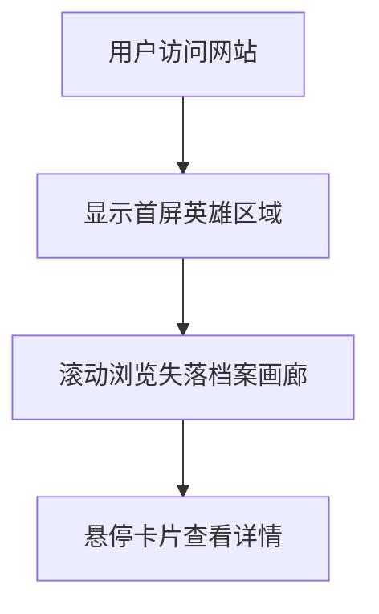

## 1. 产品概述
"香港拾遗 Relics & Resurgence"是一个探讨城市发展对香港脆弱文化遗产威胁的响应式单页网站。通过极简主义设计风格，展现城市记忆消逝的深刻主题，为用户创造沉浸式的高端美术馆体验。

目标用户：关注文化遗产保护、城市发展的公众群体，以及艺术文化爱好者。

## 2. 核心功能

### 2.1 用户角色
本网站为信息展示型平台，无需用户注册和登录功能。

### 2.2 功能模块
网站包含以下主要页面：
1. **首页**：包含首屏英雄区域和失落档案画廊展示区域

### 2.3 页面详情

| 页面名称 | 模块名称 | 功能描述 |
|---------|----------|----------|
| 首页 | 首屏英雄区域 | 显示主标题"香港拾遗 Relics & Resurgence"和副标题"在飞速发展的城市中，见证消亡，并在当下重新连接" |
| 首页 | 失落档案画廊 | 使用CSS Grid布局展示4个文化遗产卡片，包含地点名称、消失年份、消失原因，支持悬停交互效果 |

## 3. 核心流程
用户访问网站流程：
1. 用户进入网站首页
2. 首先看到首屏英雄区域的标题和副标题
3. 向下滚动浏览失落档案画廊
4. 鼠标悬停在卡片上查看详细信息

## 4. 用户界面设计

### 4.1 设计风格
- **主色调**：纯黑 (#000000)、纯白 (#FFFFFF)、中性灰 (#6B7280, #9CA3AF, #D1D5DB)
- **按钮风格**：极简无装饰，纯文字链接或细边框按钮
- **字体**：优雅的无衬线字体，标题使用大字号 (48-64px)，正文使用中等字号 (16-18px)
- **布局风格**：大量留白，居中对齐，卡片式网格布局
- **图标风格**：极简线条图标或无图标设计

### 4.2 页面设计概览

| 页面名称 | 模块名称 | UI元素 |
|---------|----------|--------|
| 首页 | 首屏英雄区域 | 全屏高度，黑色背景，白色文字居中显示。主标题使用48-64px大字号，副标题使用18-24px中等字号，行高1.5-1.8倍 |
| 首页 | 失落档案画廊 | 白色背景，使用CSS Grid创建2x2网格布局。卡片为浅灰色背景，黑色文字，包含地点名称(20-24px)、消失年份(16px)、消失原因(14-16px)。悬停时卡片放大1.05倍，显示半透明黑色遮罩层和详细描述文字 |

### 4.3 响应式设计
- **桌面优先**：默认设计为桌面版本
- **平板适配**：768px-1024px，网格调整为2列
- **手机适配**：<768px，网格调整为1列，字体大小适当缩小
- **触摸优化**：移动设备上悬停效果改为点击触发

## 5. 技术需求
- 使用React 18框架开发
- 使用Tailwind CSS进行样式设计
- 支持现代浏览器（Chrome, Firefox, Safari, Edge最新版本）
- 页面加载性能优化，首屏加载时间<3秒
- SEO友好，支持搜索引擎收录