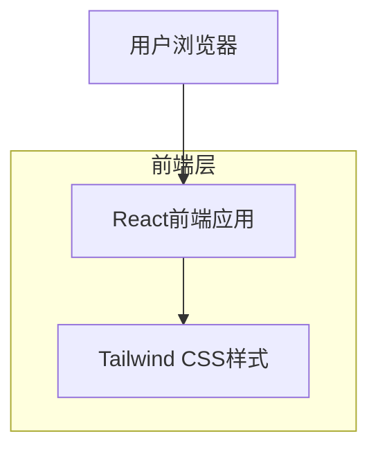

## 1. 架构设计



## 2. 技术描述

- **前端**: React@18 + Tailwind CSS@3 + Vite
- **初始化工具**: vite-init
- **后端**: 无（静态单页应用）

## 3. 路由定义

| 路由 | 用途 |
|------|------|
| / | 首页，显示英雄区域和失落档案画廊 |

## 4. 组件结构

### 4.1 主要组件

```
src/
├── components/
│   ├── HeroSection.jsx      # 首屏英雄区域组件
│   ├── LostArchives.jsx     # 失落档案画廊组件
│   └── ArchiveCard.jsx      # 档案卡片组件
├── App.jsx                  # 主应用组件
└── main.jsx                # 应用入口文件
```

### 4.2 数据结构

档案卡片数据格式：
```javascript
const archiveData = [
  {
    id: 1,
    name: "九龙寨城",
    yearGone: "1994",
    reason: "城市重建",
    description: "曾是世界人口密度最高的贫民窟，承载着独特的社区文化"
  },
  {
    id: 2,
    name: "皇后码头",
    yearGone: "2007", 
    reason: "填海工程",
    description: "香港殖民时期的重要历史建筑，见证了城市的海港发展史"
  },
  {
    id: 3,
    name: "利东街",
    yearGone: "2010",
    reason: "市区重建",
    description: "著名的喜帖街，承载着香港人的集体记忆和传统文化"
  },
  {
    id: 4,
    name: "湾仔码头",
    yearGone: "2014",
    reason: "交通规划",
    description: "连接港岛与九龙的重要交通枢纽，承载着几代人的通勤记忆"
  }
]
```

## 5. 样式实现

### 5.1 响应式断点
- `sm`: 640px
- `md`: 768px  
- `lg`: 1024px
- `xl`: 1280px

### 5.2 动画效果
- 卡片悬停使用CSS transform实现缩放效果
- 遮罩层使用opacity过渡实现淡入淡出
- 使用Tailwind的transition类实现平滑过渡

### 5.3 性能优化
- 使用React.memo优化组件渲染
- 图片懒加载（如需要真实图片）
- CSS代码分割和压缩
- 使用生产环境构建优化

## 6. 浏览器兼容性

- Chrome 88+
- Firefox 85+
- Safari 14+
- Edge 88+

## 7. 部署方案

项目构建为静态文件，可部署到：
- Vercel
- Netlify  
- GitHub Pages
- 任何支持静态文件托管的服务器